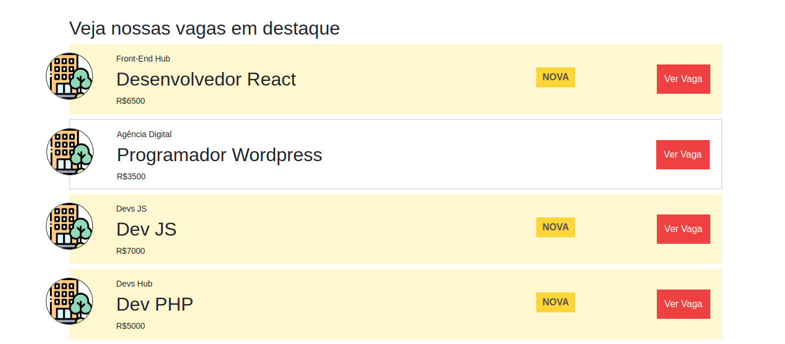
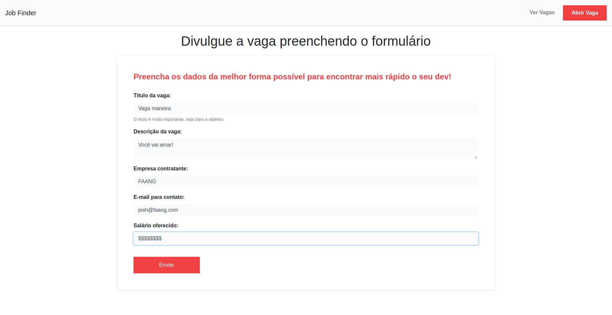
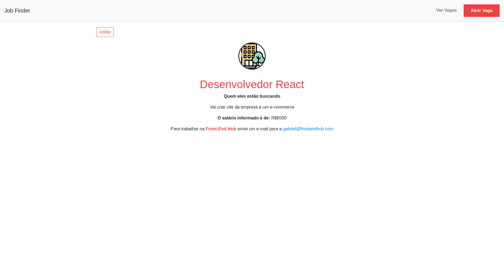

# Job Finder 
Demo: https://jobfinder-az3vedo.netlify.app/

### Tecnologias utilizadas

## Resumo do projeto
O Job Finder é uma plataforma para divulgar as vagas da sua empresa para ajudar **VOCÊ** a encontrar o dev ideal.   
E para você que é DEV encontrar ótimas oportunidades de trabalho para alavancar a sua carreira 🚀

## Screenshots
  - Página Inicial
  

  - Lista de vagas
  

  - Adicionar vaga
  

  - Visualizar vaga
  
